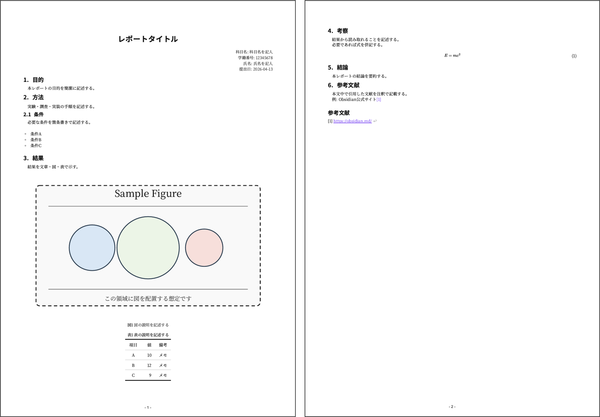

# latex-like.css

## 目的

Markdownで素早くレポートを書きつつ、LaTeX風の見た目をCSSで再現する。

- Wordより軽く書ける
- LaTeXより準備が少ない
- 図表番号や式番号をある程度自動化できる



## システム構成

このセットアップは次の3点で構成される。

1. Obsidian
2. CSSスニペット: `.obsidian/snippets/latex-like.css`
3. レポート本文: `.md` ファイル（frontmatterで `latex-like` を指定）

最小構成の例:

```md
---
cssclasses:
  - latex-like
---

# タイトル
本文
```

## 機能（できること）

- 見出し番号の自動付与（h2/h3/h4）
- 図番号の自動付与（画像直後の斜体1行をキャプション扱い）
- 表番号の自動付与（表直前の太字1行をキャプション扱い）
- ブロック数式の式番号表示
- 注釈の参考文献風表示
- A4想定の印刷レイアウト

補足:

- CSSカウンタの都合で、章番号は常に完璧ではない場合がある
- 1〜数ページ程度の提出資料での運用を想定
- ページ番号付きPDFは `obsidian-better-export-pdf` の利用を推奨

## First Step
1. obsidianインストール
2. Vault内の `.obsidian`に`snippets`フォルダを作成し`latex-like.css` を置く
   （`.obsidian/snippets/latex-like.css`とする）
3. Latexスタイルにしたいmdファイル先頭に以下を記述
  ```
---
cssclasses:
  - latex-like
---
  ```
## Contents
- `latex-like.css` : Latex風レンダリングを実現するCSS
- `report-template.md` : `latex-like.css`を用いたレポートの雛形
- `latex-like-usage-sample.md` : `latex-like.css`の使い方についてある程度詳細に解説したサンプル
- `image.png` : `report-template.md`のレンダリングサンプル
- `sample-figure.svg` : `latex-like-usage-sample.md`で用いるサンプル画像
