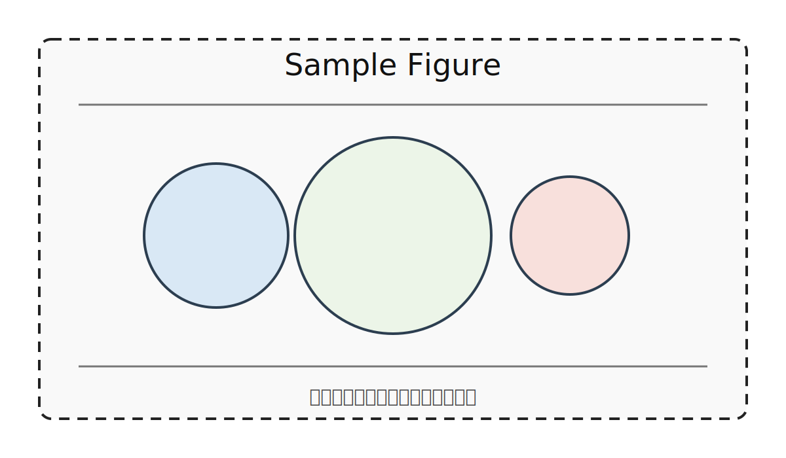

---
cssclasses:
  - latex-like
---

# レポートタイトル

科目名: 科目名を記入 
学籍番号: 12345678 
氏名: 氏名を記入 
提出日: 2026-04-13

## 目的

本レポートの目的を簡潔に記述する。

## 方法

実験・調査・実装の手順を記述する。

### 条件

必要な条件を箇条書きで記述する。

- 条件A
- 条件B
- 条件C

## 結果

結果を文章・図・表で示す。

*図の説明を記述する*

**表の説明を記述する**

| 項目 | 値 | 備考 |
|---|---:|---|
| A | 10 | メモ |
| B | 12 | メモ |
| C | 9 | メモ |

## 考察

結果から読み取れることを記述する。

必要であれば式を併記する。

$$
E = mc^2
$$

## 結論

本レポートの結論を要約する。

## 参考文献

本文中で引用した文献を注釈で記載する。

例: Obsidian公式サイト[^1]

[^1]: https://obsidian.md/
